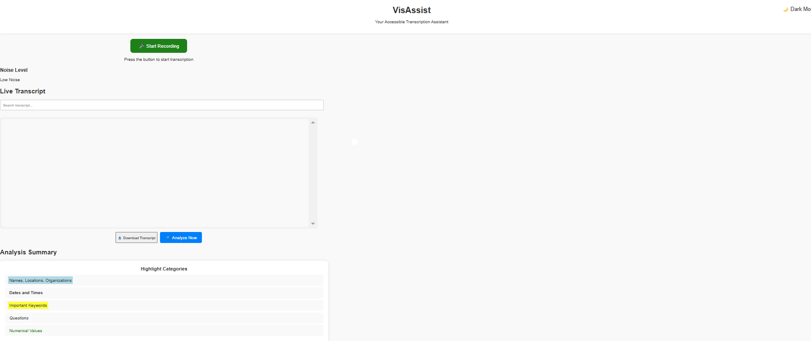
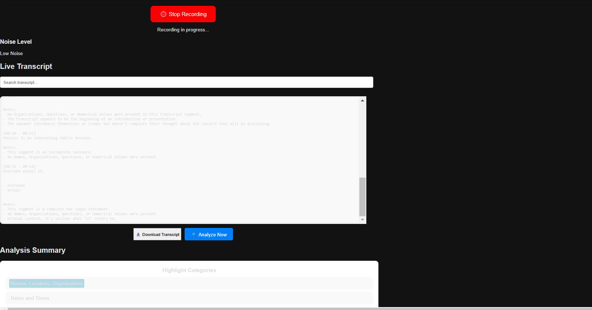

---

# **VisAssist**  
> Your Accessible Transcription Assistant


---

## **🚀 Overview**  
VisAssist is an advanced real-time transcription tool designed to empower individuals with auditory impairments. By leveraging the power of **AssemblyAI APIs**, VisAssist transforms live speech into visually accessible transcripts with rich formatting, noise level indicators, and accessibility-first features.

---

## **🌟 Features**
- **Real-Time Speech-to-Text Transcription**  
   Converts live speech into a visually organized transcript.
   
- **Categorical Highlighting**  
   - Names, Locations, Organizations: 🟦 *Blue*  
   - Dates & Times: 🟨 *Yellow*  
   - Important Keywords: 🟩 *Green*  
   - Questions: *Italicized*  
   - Numerical Values: 🟧 *Orange*
   
- **Live Noise Level Indicator**  
   Provides real-time feedback on the surrounding noise levels.

- **Search Functionality**  
   Search for specific phrases or keywords in the transcript.

- **Dark Mode Support**  
   Switch between light and dark themes for user comfort.

- **Transcript Download**  
   Export your transcription as a text file for offline use.

- **Analyze Now Button**  
   Provides detailed analysis of the transcript on demand.

---

## **🔧 Installation**
Follow these steps to set up **VisAssist** on your local machine:

### **Prerequisites**
- **Python 3.10+**
- **Git**
- AssemblyAI API Key ([Sign up for free credits](https://www.assemblyai.com/))

### **Steps**
1. **Clone the Repository**:
   ```bash
   git clone https://github.com/CosmasMandikonza/VisAssist.git
   cd VisAssist
   ```

2. **Install Dependencies**:
   Install the required Python packages:
   ```bash
   pip install -r requirements.txt
   ```

3. **Set API Key**:  
   Update the `constant.py` file with your **AssemblyAI API key**:
   ```python
   assemblyai_api_key = "YOUR_API_KEY"
   ```

4. **Run the Application**:
   Start the server with:
   ```bash
   python app.py
   ```

5. **Open in Browser**:  
   Navigate to `http://127.0.0.1:5000` in your browser.

---

## **🖼️ Screenshots**

### Homepage


### Dark Mode


### Live Transcript


---

## **📂 Project Structure**

```plaintext
VisAssist/
├── static/
│   ├── styles.css       # CSS for styling
│   ├── script.js        # JavaScript for dynamic features
│   └── assets/          # Placeholder for images or additional assets
├── templates/
│   └── index.html       # Main HTML file
├── app.py               # Backend logic (Flask app)
├── constant.py          # Stores API keys and configurations
├── requirements.txt     # Python dependencies
└── README.md            # Project documentation
```

---

## **🔑 Key Features in Detail**

### **Real-Time Categorical Highlighting**


- Names, Dates, and Key Elements are automatically detected and visually formatted.

### **Noise Level Indicator**
- **Green**: Low Noise  
- **Yellow**: Moderate Noise  
- **Red**: High Noise  


### **Download and Analyze**
- Export transcripts with a single click.
- Analyze transcripts for deeper insights into speech data.

---

## **🛠️ Technologies Used**
- **Frontend**:
  - HTML5, CSS3
  - JavaScript
  - Responsive Design

- **Backend**:
  - Flask
  - AssemblyAI API

- **Deployment**:
  - GitHub Pages / Render / Heroku

---

## **📖 Documentation**

### **API Integration**  
- AssemblyAI Streaming API for real-time transcription
- Categorical detection and formatting

### **Custom Features**  
- Dynamic Noise Feedback  
- Dark Mode Integration  
- Searchable Transcript Interface  

---

## **💻 How to Contribute**

1. **Fork the Repository**  
   Click the "Fork" button at the top right of this repository.

2. **Clone Your Fork**  
   ```bash
   git clone https://github.com/your-username/VisAssist.git
   ```

3. **Create a Feature Branch**  
   ```bash
   git checkout -b feature/your-feature-name
   ```

4. **Make Changes**  
   Commit your updates:
   ```bash
   git commit -m "Add your commit message"
   ```

5. **Push to GitHub**  
   ```bash
   git push origin feature/your-feature-name
   ```

6. **Open a Pull Request**  
   Submit your changes for review.

---

## **🧑‍🤝‍🧑 Contributors**
- [Cosmas Mandikonza](https://github.com/CosmasMandikonza)

---

## **📜 License**
This project is licensed under the **MIT License**. See the `LICENSE` file for details.

---

## **🌟 Acknowledgements**
- **AssemblyAI**: For providing the Speech-to-Text API.  
---

## **📫 Contact**
Have questions or suggestions? Reach out to us:  
📧 Email: [cosmas.t.mandikonza@gmail.com](mailto:cosmas.t.mandikonza@gmail.com)  
🌐 GitHub: [Cosmas Mandikonza](https://github.com/CosmasMandikonza)

---
